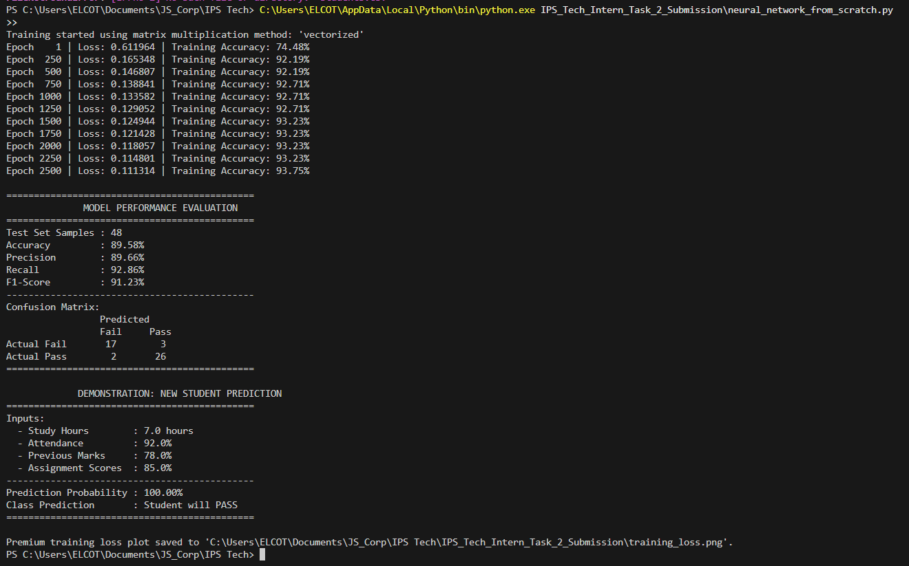
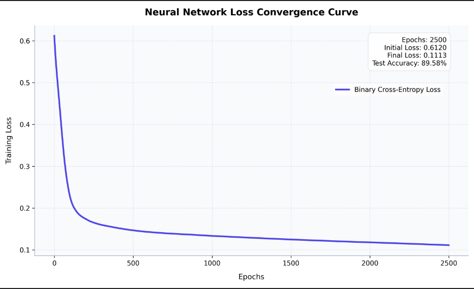

# Neural Network from Scratch using NumPy

This project implements a fully customized feedforward neural network from scratch using **only NumPy** (and Pandas/Matplotlib for data handling and plotting). The model is designed to classify students as **Pass** or **Fail** based on four features: study hours, attendance, previous marks, and assignment scores.

---

## 🚀 Setup & How to Run

1. **Install Dependencies**:
   If your standard `pip` fails with a `uv trampoline` error, use the direct Python path:
   ```bash
   C:\Users\ELCOT\AppData\Local\Python\bin\python.exe -m pip install numpy pandas matplotlib
   ```

2. **Run the Model**:
   Navigate to the `IPS_Tech_Intern_Task_2_Submission` folder and run the script:
   ```bash
   C:\Users\ELCOT\AppData\Local\Python\bin\python.exe neural_network_from_scratch.py
   ```
   *(If you are in the parent folder, run `C:\Users\ELCOT\AppData\Local\Python\bin\python.exe IPS_Tech_Intern_Task_2_Submission\neural_network_from_scratch.py`)*

3. **Switching Matrix Multiplication Methods**:
   By default, the script uses the **vectorized** broadcasting method which completes 2,500 training epochs in less than 2 seconds. If you want to demonstrate or test the manual loop-based method, open `neural_network_from_scratch.py` and modify the instantiation in `main()`:
   ```python
   # Slow manual loop-based multiplication (useful for direct translation of formulas)
   model = NeuralNetwork(..., matrix_method='loop')
   
   # Or fast vectorized broadcasting multiplication (default)
   model = NeuralNetwork(..., matrix_method='vectorized')
   ```

---

## 📐 Network Architecture

The network has a `4 → 8 → 4 → 1` layer structure:
- **Input Layer (4 features)**: Study Hours, Attendance, Previous Marks, Assignment Scores.
- **Hidden Layer 1 (8 neurons)**: ReLU activation.
- **Hidden Layer 2 (4 neurons)**: ReLU activation.
- **Output Layer (1 neuron)**: Sigmoid activation (predicts probability of passing).

---

### 1. Weights and Biases ($W$ and $b$)
*   **Weights ($W$)**: Parameters that scale the inputs of a layer, representing the connection strength between neurons. They determine the slope/orientation of the decision boundary.
*   **Biases ($b$)**: Parameters added to the weighted inputs. They allow shifting the activation function left or right, enabling neurons to fire even if all inputs are zero.
*   **Initializations**:
    *   **He (Kaiming) Initialization** (used for ReLU hidden layers):
        $$W \sim \mathcal{N}\left(0, \sqrt{\frac{2}{\text{fan\_in}}}\right)$$
        *Reason:* Prevents vanishing/exploding gradients in deep networks using ReLU by keeping the variance of activations consistent across layers.
    *   **Xavier (Glorot) Initialization** (used for Sigmoid output layer):
        $$W \sim \mathcal{N}\left(0, \sqrt{\frac{1}{\text{fan\_in}}}\right)$$
        *Reason:* Tailored for symmetric activation functions like Sigmoid/Tanh to keep the variance of the gradients balanced.

### 2. Forward Propagation Equations
For a training sample matrix $X$ of shape $(m \times 4)$:
1.  **Hidden Layer 1**:
    $$Z^{(1)} = X W^{(1)} + b^{(1)} \quad \text{(Shape: } m \times 8\text{)}$$
    $$A^{(1)} = \text{ReLU}\left(Z^{(1)}\right) = \max\left(0, Z^{(1)}\right)$$
2.  **Hidden Layer 2**:
    $$Z^{(2)} = A^{(1)} W^{(2)} + b^{(2)} \quad \text{(Shape: } m \times 4\text{)}$$
    $$A^{(2)} = \text{ReLU}\left(Z^{(2)}\right) = \max\left(0, Z^{(2)}\right)$$
3.  **Output Layer**:
    $$Z^{(3)} = A^{(2)} W^{(3)} + b^{(3)} \quad \text{(Shape: } m \times 1\text{)}$$
    $$A^{(3)} = \text{Sigmoid}\left(Z^{(3)}\right) = \frac{1}{1 + e^{-Z^{(3)}}} = \hat{y}$$

### 3. Activation Functions & Derivatives
*   **ReLU**:
    $$g(z) = \max(0, z) \implies g'(z) = \begin{cases} 1 & \text{if } z > 0 \\ 0 & \text{if } z \le 0 \end{cases}$$
*   **Sigmoid**:
    $$g(z) = \frac{1}{1 + e^{-z}} \implies g'(z) = g(z)(1 - g(z))$$

### 4. Loss Function: Binary Cross-Entropy (BCE)
Measures classification error for binary targets $y \in \{0, 1\}$ and predictions $\hat{y} \in (0, 1)$:
$$\mathcal{L} = -\frac{1}{m} \sum_{i=1}^{m} \left[ y_i \ln(\hat{y}_i) + (1 - y_i) \ln(1 - \hat{y}_i) \right]$$

### 5. Backpropagation Derivations (The Chain Rule)
We compute the partial derivatives of the loss $\mathcal{L}$ backwards from output to input.

#### A. Output Layer (Layer 3)
We want to find how the loss changes with respect to $Z^{(3)}$.
Using the chain rule:
$$\frac{\partial \mathcal{L}}{\partial Z^{(3)}} = \frac{\partial \mathcal{L}}{\partial A^{(3)}} \cdot \frac{\partial A^{(3)}}{\partial Z^{(3)}}$$
1.  **Loss derivative w.r.t. prediction $A^{(3)}$**:
    $$\frac{\partial \mathcal{L}}{\partial A^{(3)}} = -\frac{1}{m} \left( \frac{y}{A^{(3)}} - \frac{1-y}{1-A^{(3)}} \right) = \frac{1}{m} \left( \frac{A^{(3)} - y}{A^{(3)}(1-A^{(3)})} \right)$$
2.  **Activation derivative w.r.t. pre-activation $Z^{(3)}$**:
    $$\frac{\partial A^{(3)}}{\partial Z^{(3)}} = A^{(3)}(1 - A^{(3)})$$
3.  **Combine them (Gives the elegant simplified term)**:
    $$dZ^{(3)} = \frac{\partial \mathcal{L}}{\partial Z^{(3)}} = \frac{1}{m} (A^{(3)} - y) \cdot A^{(3)}(1 - A^{(3)}) \implies dZ^{(3)} = A^{(3)} - y$$ (scaled by $1/m$ in updates)

From $dZ^{(3)}$, we compute gradients for parameters $W^{(3)}$ and $b^{(3)}$:
$$dW^{(3)} = \frac{1}{m} (A^{(2)})^T dZ^{(3)}$$
$$db^{(3)} = \frac{1}{m} \sum_{i=1}^{m} dZ^{(3)}_i$$

#### B. Hidden Layer 2
First backpropagate the error to activations $A^{(2)}$:
$$dA^{(2)} = dZ^{(3)} (W^{(3)})^T$$
Now apply the element-wise ReLU derivative:
$$dZ^{(2)} = dA^{(2)} \odot \text{ReLU}'(Z^{(2)})$$
Compute gradients:
$$dW^{(2)} = \frac{1}{m} (A^{(1)})^T dZ^{(2)}$$
$$db^{(2)} = \frac{1}{m} \sum_{i=1}^{m} dZ^{(2)}_i$$

#### C. Hidden Layer 1
Backpropagate the error to activations $A^{(1)}$:
$$dA^{(1)} = dZ^{(2)} (W^{(2)})^T$$
Apply the element-wise ReLU derivative:
$$dZ^{(1)} = dA^{(1)} \odot \text{ReLU}'(Z^{(1)})$$
Compute gradients:
$$dW^{(1)} = \frac{1}{m} X^T dZ^{(1)}$$
$$db^{(1)} = \frac{1}{m} \sum_{i=1}^{m} dZ^{(1)}_i$$

### 6. Gradient Descent Updates
Using a learning rate $\alpha$:
$$W^{(l)} \leftarrow W^{(l)} - \alpha \cdot dW^{(l)}$$
$$b^{(l)} \leftarrow b^{(l)} - \alpha \cdot db^{(l)}$$

---

## 🎯 Typical Viva Questions & Core Concepts

1.  **Q: Why do we standardize features before training?**
    *   **A:** Features have different ranges (e.g., Attendance is 0–100%, Study Hours is 0–10). If unstandardized, features with larger scales dominate the gradient updates, causing the loss function surface to be highly elongated. Standardization creates a symmetric loss surface, allowing gradient descent to converge much faster and use a higher learning rate without diverging.

2.  **Q: What is the benefit of the He weight initialization over simple random initialization?**
    *   **A:** If weights are initialized too small, the signals shrink as they pass through layers, leading to vanishing gradients. If they are too large, they explode. He initialization adjusts the variance of weights based on the input size ($\sqrt{2/\text{fan\_in}}$), which keeps the output variance constant, ensuring stable training in layers with ReLU activations.

3.  **Q: Why is ReLU preferred in hidden layers over Sigmoid?**
    *   **A:** Sigmoid saturates (flattens out) at large positive or negative values, where its derivative is near zero. This leads to the vanishing gradient problem, preventing weights in earlier layers from training. ReLU has a constant derivative of 1 for all positive inputs, ensuring gradients flow freely. It is also computationally cheap ($\max(0, z)$ is a simple thresholding operation).

4.  **Q: Why do we use Sigmoid in the output layer instead of ReLU?**
    *   **A:** We are performing binary classification (Pass vs Fail). Sigmoid squashes outputs to the range $(0, 1)$, which represents the probability of a student passing. A ReLU output could exceed 1 or be 0 for a wide range of values, which does not map well to binary probability.



